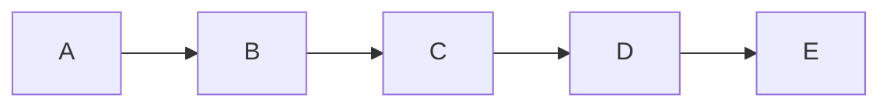
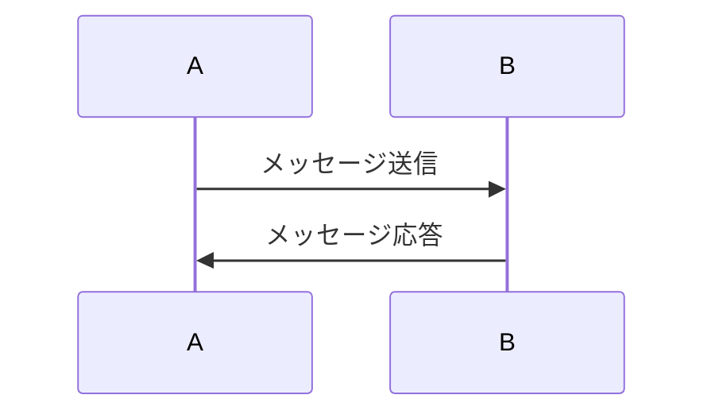
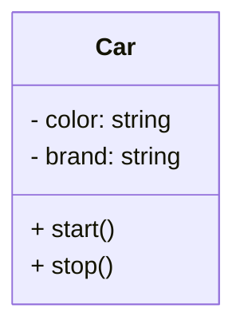
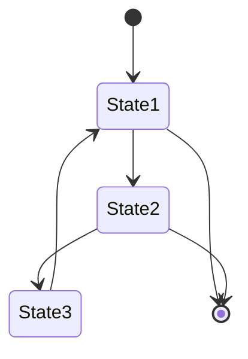
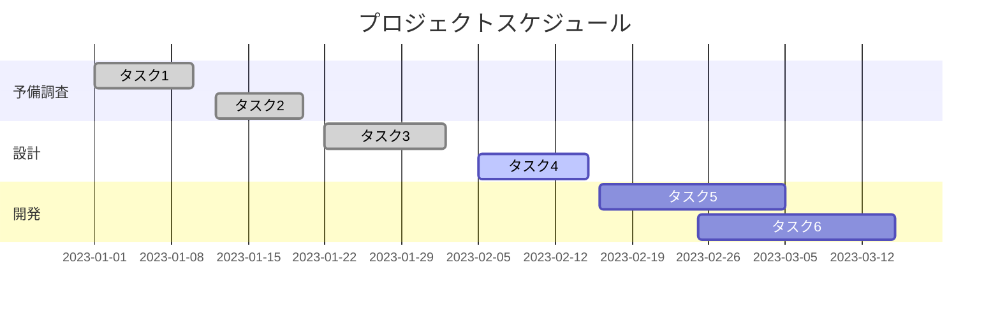

## mermaidで記述できるダイアグラムの記述例とコード
今回は、mermaidを使って作れるダイアグラムを紹介します。
#### 目次
```
1. フローチャート
2. シーケンス図
3. クラス図
4.　ステートマシン図
5. ガントチャート
```
##  フローチャート
フローチャートは、上記の要素を組み合わせて、プロセスの手順やフローを示す図を作成します。各要素は適切な記号やテキストでラベル付けされ、明確な意味を持ちます。
フローチャートを作成することで、複雑な手順やアルゴリズムをシンプルに表現し、理解しやすくすることができます。また、フローチャートは問題の特定部分の改善や効率化のための分析や改善提案の基礎としても使用されます。
次に、実際にコード書いて紹介します。
```
graph LR
    A --> B
    B --> C
    C --> D
    D --> E
```


## シーケンス図
シーケンス図は、オブジェクト間の相互作用やメッセージの流れを時間の経過とともに示すための図です。主にソフトウェア開発やシステム設計の分野で使用され、システムの振る舞いやプロセスの流れを視覚的に表現するために利用されます。
次に、実際にコード書いて紹介します。
```
sequenceDiagram
    participant A
    participant B
    A->>B: メッセージ送信
    B->>A: メッセージ応答
```


## クラス図
クラス図は、ソフトウェアの静的な構造を表現するための図です。主にオブジェクト指向プログラミングやシステム設計の分野で使用され、システム内のクラスやオブジェクト、それらの属性や関係性を視覚的に表現するために利用されます。
次に、実際にコード書いて紹介します。
```
classDiagram
    class Car {
        - color: string
        - brand: string
        + start()
        + stop()
    }
```


##　ステートマシン図
ステートマシン図（State Machine Diagram）は、システムやオブジェクトの状態とそれらの状態間の遷移を表現するための図です。主にソフトウェア開発やシステム設計の分野で使用され、システムやオブジェクトの振る舞いや状態遷移を視覚的に表現するために利用されます。
実際にコードを書きます。
```
stateDiagram
    [*] --> State1
    State1 --> State2
    State1 --> [*]
    State2 --> State3
    State2 --> [*]
    State3 --> State1
```


## ガントチャート
ガントチャート（Gantt Chart）は、プロジェクトの進捗管理やスケジュール管理のために使用される視覚的なツールです。タイムライン上にタスクや活動の開始日、終了日、進捗状況などを棒グラフやバーで表示し、プロジェクトの計画と実績を一目で把握することができます。
実際にコードを書きます。
```
gantt
    title プロジェクトスケジュール
    dateFormat  YYYY-MM-DD
    section 予備調査
    タスク1: done, 2023-01-01, 2023-01-10
    タスク2: done, 2023-01-12, 2023-01-20
    section 設計
    タスク3: done, 2023-01-22, 2023-02-02
    タスク4: active, 2023-02-05, 2023-02-15
    section 開発
    タスク5: 2023-02-16, 2023-03-05
    タスク6: 2023-02-25, 2023-03-15
```
