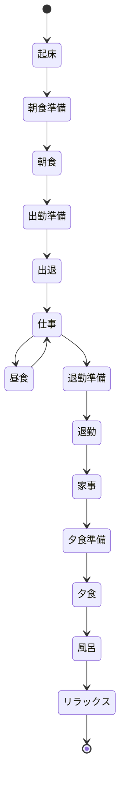

### mermaidで記述できるダイアグラムのチュートリアル
今回は、ダイアグラムの中のステートマシン図について簡単な説明を書きます。

#### 目次
```
1. 作り方
2. 軽い説明
3. 実際に作って見る
4. まとめ
```

 ### Step 1: ステートマシン図の作り方
ステートマシン図を作るためには、以下のMermaidのテキストベースの記法を使用します。
```
stateDiagram-v2
    [*] --> 初期状態
    初期状態 --> 状態1
    状態1 --> 状態2
    状態2 --> [*]
```    
上記の例では、初期状態から始まり、状態1から状態2への遷移があります。また、状態2から[*]という記号によって終了することを示しています。

 ### Step 2: ステートマシン図の説明
ステートマシン図は、オブジェクトやシステムの振る舞いや状態の遷移を視覚的に表現するための図です。主にソフトウェアやシステムの設計、ワークフローのモデリング、プロセスの可視化などに使用されます。

### Step 3: ステートマシン図を作ってみる
今回は社会人の一日をステートマシン図で作ってみます。
```
stateDiagram-v2
    [*] --> 起床
    起床 --> 朝食準備
    朝食準備 --> 朝食
    朝食 --> 出勤準備
    出勤準備 --> 出退
    出退 --> 仕事
    仕事 --> 昼食
    昼食 --> 仕事
    仕事 --> 退勤準備
    退勤準備 --> 退勤
    退勤 --> 家事
    家事 --> 夕食準備
    夕食準備 --> 夕食
    夕食 --> 風呂
    風呂 --> リラックス
    リラックス --> [*]
```    
これをマーメイドで出したいと思います。

### Step 4:まとめ
このチュートリアルでは、Mermaidを使用してステートマシン図を作成する方法を紹介しました。ステートマシン図はオブジェクトやシステムの振る舞いや状態遷移を視覚的に表現するための図です。

作成手順としては、以下のステップを踏みました。

1. Mermaidのテキストベースの記法を使用してステートマシン図を作成します。
2. ステートマシン図は、初期状態や各状態、遷移を表す要素から構成されます。
3. 実際に社会人の一日をステートマシン図で表現する例を作成しました。

Mermaidを使用することで、簡潔な記法でステートマシン図を作成することができます。さまざまなシナリオやプロセスの振る舞いを視覚化し、理解しやすくすることができます。